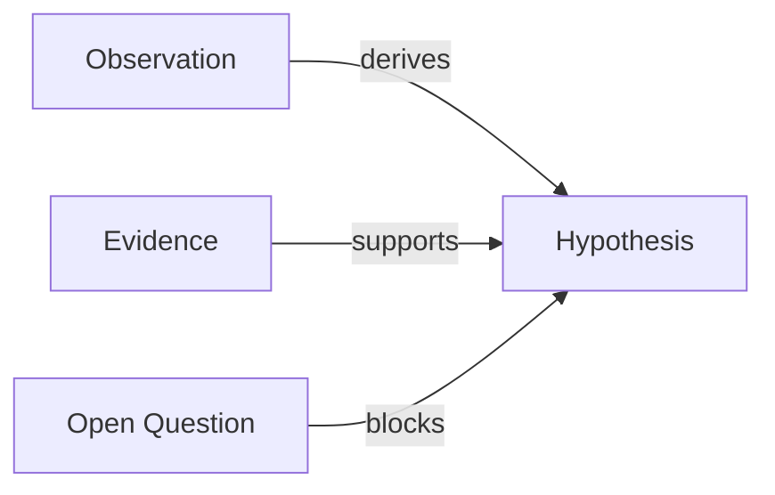

# Detective v2.1 Autonomous Investigation Design

## Summary

Detective v2.1 builds on the v2 MCP graph core by adding autonomous investigation orchestration. The MCP server remains responsible for graph state, persistence, and deterministic graph algorithms. Claude and subagents remain responsible for reasoning, exploration, and judgment.

The v2.1 goal is to let detective run mostly automatically: it should dispatch specialized agents, record their findings as graph nodes and edges through MCP tools, detect when the investigation is stuck or converged, and ask the user only when human judgment is needed or when the user intervenes.

## Dependency

This design assumes Detective v2 MCP Graph Core exists with these capabilities:

- Case creation/loading/saving.
- Node and edge CRUD.
- Graph overview.
- Node search/listing.
- Neighbor and shortest-path queries.
- Markdown and Mermaid exports.
- JSON persistence under `.detective/`.

v2.1 should not bypass the MCP server by writing case JSON directly.

## Goals

- Add an autonomous investigation loop over the MCP graph core.
- Support default full automation with user intervention as highest-priority guidance.
- Add specialized investigation agents that use MCP tools for shared state.
- Add scheduling memory for what has been tried, what went cold, and what should happen next.
- Add convergence and deadlock detection sufficient to pause, continue, or close a case.
- Generate richer Markdown/Mermaid investigation artifacts for review.
- Keep the system generic for open/semi-open research, not tied to OSINT, code archaeology, or RCA.

## Non-goals

- Do not make the MCP server itself call Claude or spawn agents.
- Do not add external web crawling or OSINT-specific integrations as core behavior.
- Do not implement cross-project global memory in v2.1.
- Do not require a browser UI.
- Do not optimize for high-throughput parallel writes; local single-session use remains the baseline.

## Autonomy model

Each case has an autonomy config:

```json
{
  "autonomy": "manual | checkpoint | full_auto",
  "checkpoint_interval": 5,
  "max_actions": 50,
  "user_override_policy": "always_priority"
}
```

Default:

```json
{
  "autonomy": "full_auto",
  "checkpoint_interval": 5,
  "max_actions": 50,
  "user_override_policy": "always_priority"
}
```

Rules:

- In `manual`, the lead investigator proposes actions and waits for user approval.
- In `checkpoint`, the system runs several actions and pauses at checkpoints.
- In `full_auto`, the system continues until convergence, deadlock, budget exhaustion, or user intervention.
- Any explicit user guidance becomes high-priority graph state and overrides automated scheduling.

## Orchestration boundary

```text
Lead investigator skill/command
   │
   ├─ dispatches subagents
   ├─ decides next action
   ├─ interprets user guidance
   └─ calls MCP tools

MCP graph server
   │
   ├─ stores case graph
   ├─ records action/event history
   ├─ runs graph queries
   ├─ exports Markdown/Mermaid
   └─ provides deterministic status signals
```

The MCP server is not an LLM agent. It does not decide meaning, truth, or strategy beyond deterministic scoring helpers.

## Agent roles

### lead-investigator

Owns the investigation loop.

Responsibilities:

- Read graph overview.
- Select next investigation phase.
- Dispatch specialist agents.
- Merge agent findings into the graph.
- Detect when to pause, ask the user, or close.
- Maintain a concise narrative of progress.

### hypothesis-generator

Produces candidate explanations from current observations and open questions.

Outputs:

- New `hypothesis` nodes.
- `derives` edges from observations/questions to hypotheses.
- Confidence estimates and rationale.

### evidence-hunter

Looks for evidence relevant to active hypotheses.

Outputs:

- `evidence` or `clue` nodes.
- `supports`, `contradicts`, or `related_to` edges.
- Source metadata.

### contradiction-finder

Attempts to falsify strong hypotheses.

Outputs:

- Contradicting evidence.
- Eliminating constraints.
- Open questions where evidence is insufficient.

### path-analyzer

Uses graph queries to identify missing links, isolated nodes, weak chains, and shortest paths between important fragments.

Outputs:

- `question` or `task` nodes for gaps.
- Recommendations to the lead investigator.

### report-writer

Generates review artifacts from graph state.

Outputs:

- Improved Markdown summaries.
- Mermaid diagrams.
- Resolution drafts.

## Scheduling memory

v2.1 adds scheduling state to `case.json` and/or `events.jsonl`.

Minimum structure:

```json
{
  "scheduler": {
    "attempted_directions": [
      {
        "id": "dir_...",
        "description": "...",
        "target_node_ids": ["n_..."],
        "attempts": 3,
        "new_evidence_count": 0,
        "status": "active | cold | blocked | completed",
        "last_attempted_at": "..."
      }
    ],
    "next_actions": [
      {
        "id": "act_...",
        "description": "...",
        "assigned_role": "evidence-hunter",
        "priority": 0.8,
        "reason": "...",
        "status": "pending | running | completed | failed"
      }
    ]
  }
}
```

This is case-local memory, not global Claude memory.

## Investigation loop

One autonomous loop iteration:

1. Load graph overview through MCP.
2. Identify active hypotheses, unresolved questions, isolated evidence, and cold directions.
3. Generate candidate next actions.
4. Score candidates using simple information-gain heuristics.
5. Dispatch one or more specialist agents when tasks are independent.
6. Require each agent to write findings back through MCP tools.
7. Re-run graph overview and path/gap checks.
8. Export Markdown and Mermaid if meaningful graph changes occurred.
9. Decide whether to continue, pause, ask the user, or recommend closure.

## Candidate action scoring

v2.1 can start with a simple scoring model:

```text
score = information_gain * feasibility * urgency / normalized_cost
```

Inputs:

- `information_gain`: How many active hypotheses or open questions the action may discriminate.
- `feasibility`: Likelihood that the action can produce useful evidence.
- `urgency`: Whether the action blocks other work.
- `cost`: Expected tool/agent/time cost.

Cold-direction penalty:

```text
if direction.attempts >= 3 and direction.new_evidence_count == 0:
    mark cold and strongly down-rank
```

## User intervention handling

When the user provides guidance during an active case:

- A factual statement becomes an `evidence` or `observation` node with `source=user` and high confidence.
- A suggested theory becomes a `hypothesis` node with elevated initial confidence.
- A boundary or disallowed path becomes a `constraint` node.
- A priority change updates scheduler action priorities.
- A correction can mark prior nodes as `stale` or `rejected`.

The lead investigator must re-read the graph overview after applying user guidance before continuing automation.

## Convergence detection

v2.1 convergence should remain conservative.

A case can be recommended for closure when:

- At least one hypothesis is strongly supported.
- Major alternative hypotheses are rejected, stale, or below confidence threshold.
- The supporting chain from key observations to conclusion has no obvious missing edge.
- No high-priority open question blocks the conclusion.
- Recent autonomous rounds produce diminishing new evidence.

The system may still ask the user whether to close if uncertainty remains.

## Deadlock detection

Trigger user discussion when:

- Top hypotheses have similar confidence and no cheap discriminator exists.
- Candidate actions all score below a configured threshold.
- Multiple recent actions produced no new nodes or edges.
- The graph contains contradictions that cannot be resolved through available tools.
- The action budget is nearly exhausted.

## Markdown output enhancements

v2.1 Markdown export should include:

- Executive summary.
- Current leading hypotheses.
- Evidence table.
- Contradictions and unresolved questions.
- Cold directions.
- Agent activity summary.
- Suggested next actions.
- Resolution draft when convergence is near.

## Mermaid output enhancements

v2.1 Mermaid export should support multiple diagram styles:

- Full graph.
- Leading hypothesis evidence chain.
- Contradiction map.
- Open-question dependency graph.
- Agent task flow.

Example:



If Mermaid does not support a relationship semantically, use labeled edges rather than custom unsupported syntax.

## Skill and command updates

v2.1 should update detective skills to prefer MCP tools:

- `open-case`: call `detective_open_case`.
- `investigate`: become the lead-investigator loop.
- `review-board`: call overview/list/search/export tools.
- `discuss-case`: write user guidance into the graph through MCP.
- `close-case`: use convergence signals and export a resolution.

Commands can pre-allow specific MCP tools rather than using broad wildcards.

## Testing strategy

Add tests or scripted checks for:

- Scheduler records attempted directions.
- Cold directions are deprioritized.
- User guidance updates graph state and scheduler priorities.
- Independent tasks can be represented as pending actions for different agent roles.
- Convergence recommendation remains false when blocking questions exist.
- Deadlock recommendation triggers when all candidate actions are low value.
- Markdown includes agent activity and cold directions.
- Mermaid exports focused diagrams.

## Acceptance criteria

- A case can run in `full_auto` mode until convergence, deadlock, budget exhaustion, or user intervention.
- Specialist agents can contribute findings without directly editing JSON.
- User intervention is captured as graph state and overrides automated priority.
- Scheduler memory records attempted directions and next actions.
- Review artifacts show both reasoning graph and investigation progress.
- v2 MCP graph core remains the only state mutation interface.

## Rollout plan

1. Implement v2 MCP graph core.
2. Update README and plugin metadata to explain MCP tools.
3. Add lead-investigator workflow using MCP tools.
4. Add scheduler state and simple action scoring.
5. Add specialist agents one at a time.
6. Add convergence/deadlock signals.
7. Enhance Markdown/Mermaid exports.
8. Consider domain profiles for OSINT, code archaeology, and RCA after generic behavior is stable.
